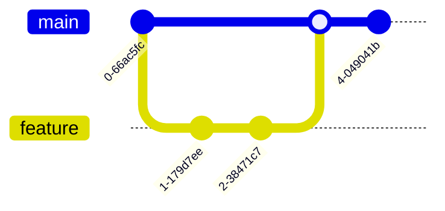

# Introducción a Git y Github

## Diferencia entre Git y GitHub

En el mundo del desarrollo de software, es común escuchar los términos Git y GitHub usados de manera intercambiable, pero representan herramientas distintas con propósitos complementarios.

Git es un sistema de control de versiones distribuido creado por Linus Torvalds en 2005. Imagina Git como una máquina del tiempo para tu código: te permite registrar los cambios realizados en tus archivos a lo largo del tiempo, volver a versiones anteriores si algo sale mal, y trabajar en diferentes características simultáneamente sin interferir entre ellas. Es como tener puntos de guardado en un videojuego, pero con la capacidad de crear líneas temporales alternativas.

:::important
Git es una herramienta local que funciona en tu computadora, mientras que GitHub es una plataforma en la nube que aprovecha las capacidades de Git para facilitar la colaboración en equipo.
:::

GitHub, por otro lado, es una plataforma web construida sobre Git que añade una capa social y colaborativa al desarrollo de software. Si Git es tu máquina del tiempo local, GitHub es como una red social para programadores donde puedes:
- Compartir tu código con otros desarrolladores
- Colaborar en proyectos de código abierto
- Realizar seguimiento de problemas y bugs
- Automatizar pruebas y despliegues
- Gestionar proyectos y equipos
- Crear documentación colaborativa

## Instalación y Configuración

La instalación de Git es el primer paso en tu viaje hacia el control de versiones efectivo. El proceso varía según tu sistema operativo, pero hemos preparado guías detalladas para las plataformas más comunes.

### Windows

En Windows, tienes dos métodos principales para instalar Git:

#### Método 1: Usando WinGet (Recomendado)

WinGet es el gestor de paquetes oficial de Windows que permite instalar aplicaciones de forma sencilla desde la línea de comandos. Este método es más moderno y automatizado.

:::info
WinGet viene preinstalado en Windows 11 y versiones recientes de Windows 10. Si no lo tienes instalado, Windows te dirigirá automáticamente a la Microsoft Store para instalarlo.
:::

1. Abre PowerShell o la Terminal de Windows y verifica si tienes WinGet:
```powershell
winget --version
```

2. Si WinGet está instalado, instala Git con el siguiente comando:
```powershell
winget install --id Git.Git -e --source winget
```

Este comando instalará Git con la configuración por defecto, que es adecuada para la mayoría de los usuarios.

#### Método 2: Instalador Tradicional

Si prefieres más control sobre las opciones de instalación, puedes usar el instalador tradicional:

1. Visita https://git-scm.com/downloads/win y descarga el instalador oficial.

2. Durante la instalación, encontrarás varias opciones importantes:

   - En "Adjusting your PATH environment", selecciona "Git from the command line and also from 3rd-party software"
   - Para el editor por defecto, recomendamos Visual Studio Code si lo tienes instalado
   - En la opción de nombre de rama por defecto, selecciona "main"
   - Para el final de línea, elige "Checkout Windows-style, commit Unix-style line endings"

:::tip
Windows Terminal proporciona una experiencia mucho mejor que la terminal por defecto de Windows. Puedes instalarlo desde la Microsoft Store.
:::

3. Una vez instalado, abre Git Bash o Windows Terminal y configura tu identidad:
```bash
git config --global user.name "Tu Nombre"
git config --global user.email "tu@email.com"
```

### Linux

La instalación en Linux varía según la distribución, pero generalmente es más simple que en Windows ya que muchas distribuciones incluyen Git por defecto.

Para Ubuntu/Debian, abre una terminal y ejecuta:
```bash
sudo apt update
sudo apt install git
```

Para Fedora:
```bash
sudo dnf install git
```

Después de la instalación, configura tu identidad como en Windows:
```bash
git config --global user.name "Tu Nombre"
git config --global user.email "tu@email.com"
```

:::info
La configuración global de Git se almacena en el archivo ~/.gitconfig. Puedes editarlo directamente si lo prefieres.
:::

## GitHub CLI (gh)

GitHub CLI (gh) es una herramienta oficial que trae la experiencia de GitHub a tu terminal. Es como tener GitHub en tu línea de comandos, permitiéndote gestionar repositorios, issues y pull requests sin salir de la terminal.

La instalación de gh varía según tu sistema operativo:

En Windows, puedes usar winget:
```bash
winget install GitHub.cli
```

En Ubuntu/Debian:
```bash
sudo apt install gh
```

Una vez instalado, necesitas autenticarte. En este curso utilizaremos HTTPS:

```bash
gh auth login
```

Durante el proceso de autenticación:
1. Selecciona `HTTPS` como protocolo preferido
2. Responde `Y` a "Authenticate Git with your GitHub credentials"
3. Elige `Login with a web browser`
4. Se abrirá tu navegador para completar la autenticación

:::info
Existen dos formas principales de autenticarse con GitHub:

**HTTPS**:
- Usa tokens de acceso personal
- Más simple de configurar
- Es el método que usaremos en el curso

**SSH (Secure Shell)**:
- Utiliza un par de llaves (pública y privada)
- Más seguro para uso profesional
- Requiere generar llaves SSH y añadirlas a GitHub
- Común en entornos empresariales

Si en el futuro trabajas en un equipo de desarrollo, probablemente uses SSH, pero para aprender los conceptos básicos de Git, HTTPS es suficiente y más directo.
:::

Una vez autenticado, gh configurará automáticamente Git para usar las mismas credenciales, lo que significa que no necesitarás autenticarte por separado para comandos git.

Algunos comandos útiles que puedes ejecutar con gh:
```bash
gh repo create        # Crear un nuevo repositorio
gh repo clone        # Clonar un repositorio existente
gh pr create         # Crear un pull request
gh issue create      # Crear un issue
gh pr review        # Revisar un pull request
```

## Flujo Básico de Trabajo

El flujo de trabajo básico en Git sigue un patrón que se puede visualizar como un ciclo de vida de los cambios:


Comencemos con un proyecto nuevo. Primero, necesitas clonar el repositorio:
```bash
git clone https://github.com/usuario/repositorio.git
```

Este comando crea una copia local completa del repositorio, incluyendo toda su historia. Es como descargar una copia de trabajo que mantiene una conexión con el repositorio original.

Cuando realizas cambios en tus archivos, Git los detecta pero no los rastrea automáticamente. Puedes ver el estado de tus cambios con:
```bash
git status
```

Para ver exactamente qué ha cambiado en los archivos:
```bash
git diff
```

:::tip
Usa `git diff --staged` para ver los cambios que ya están en el área de staging.
:::

Cuando estés satisfecho con tus cambios, necesitas prepararlos para un commit:
```bash
git add archivo.txt    # Añadir un archivo específico
git add .             # Añadir todos los cambios
```

### El Área de Staging

El área de staging (también conocida como "index" o "área de preparación") es uno de los conceptos más importantes en Git, pero también uno de los más confusos para principiantes. Veamos qué es y cómo funciona:

#### ¿Qué es Staging?

Imagina que estás preparando un paquete para enviar por correo. Tienes:
- Tu escritorio de trabajo (directorio de trabajo)
- Una caja de preparación (área de staging)
- El paquete final sellado (commit)

El área de staging es esa "caja de preparación" donde decides qué cambios quieres incluir en tu próximo commit. Es como un área intermedia donde puedes revisar y organizar tus cambios antes de hacerlos permanentes.


#### ¿Por qué es útil?

1. **Control granular**: Puedes tener 10 archivos modificados pero commit solo 5
2. **Revisión**: Oportunidad de revisar cambios antes de commit
3. **Organización**: Permite agrupar cambios relacionados en commits separados

#### Ejemplo práctico

Supongamos que estás trabajando en un proyecto y has:
- Corregido un bug en `login.js`
- Añadido comentarios en `utils.js`
- Creado un nuevo archivo `feature.js`

Puedes:
```bash
git add login.js        # Añadir solo la corrección del bug
git commit -m "fix: corrige error en login"

git add utils.js feature.js  # Añadir los otros cambios
git commit -m "feat: añade nueva funcionalidad"
```

:::tip
Usa `git status` para ver qué archivos están en staging y cuáles no.
Usa `git diff --staged` para ver los cambios en staging.
:::

#### Comandos útiles para staging

```bash
git add archivo.txt     # Añadir un archivo específico
git add .              # Añadir todos los cambios
git add *.js           # Añadir todos los archivos .js
git add -p             # Añadir cambios interactivamente por partes
git reset HEAD archivo # Quitar un archivo de staging
```

:::info
**¿Qué es HEAD?**
HEAD es simplemente un puntero que indica el último commit de tu rama actual. Es como un "estás aquí" en el mapa de tu repositorio. Cuando usas `git reset HEAD`, le estás diciendo a Git "quiero que este archivo vuelva al estado en que estaba en el último commit".

Otros usos comunes de HEAD:
- `HEAD~1`: Commit anterior al actual
- `HEAD~2`: Dos commits antes
- `HEAD^`: Otra forma de referirse al commit anterior
  :::

:::warning
El área de staging mantiene una copia de tus archivos. Si modificas un archivo después de añadirlo a staging, necesitarás hacer `git add` nuevamente para incluir los nuevos cambios.
:::

Ahora puedes crear un commit con estos cambios:
```bash
git commit -m "Añade funcionalidad de login"
```

:::important
Un buen mensaje de commit debe completar la frase "Si aplico este commit, este commit...". Por ejemplo: "Añade validación de formularios de registro"
:::

Finalmente, para compartir tus cambios con otros, necesitas subirlos al repositorio remoto:
```bash
git push origin main
```

## Trabajo en Equipo

El trabajo en equipo con Git requiere una comprensión clara de las ramas (branches) y cómo gestionar los cambios de múltiples personas. Veamos cómo funciona:



### Gestión de Ramas

Las ramas son como líneas temporales alternativas para tu código. La rama principal (generalmente llamada 'main') contiene el código de producción, mientras que las ramas de características (feature branches) se utilizan para desarrollar nuevas funcionalidades sin afectar al código principal.

Para crear y cambiar a una nueva rama:
```bash
git checkout -b feature/login
```

Este comando combina dos operaciones:
1. Crear una nueva rama (`git branch feature/login`)
2. Cambiar a esa rama (`git checkout feature/login`)

:::warning
Asegúrate de que tu rama principal esté actualizada antes de crear una nueva rama:
```bash
git checkout main
git pull
git checkout -b feature/nueva-funcionalidad
```
:::

### Manteniendo las Ramas Actualizadas

Mientras trabajas en tu rama, otros desarrolladores pueden hacer cambios en la rama principal. Para mantener tu rama actualizada, puedes usar rebase:

```bash
git checkout main
git pull
git checkout feature/login
git rebase main
```

El rebase reescribe la historia de tu rama, colocando tus commits después de los últimos cambios de la rama principal. Esto mantiene una historia más limpia y lineal.

:::warning
El rebase reescribe el historial de commits, creando nuevos commits con diferente hash aunque tengan el mismo contenido. Si ya has compartido tu rama (push), otros desarrolladores pueden tener la versión anterior de la historia. Cuando intenten sincronizar sus cambios, Git verá dos historias diferentes y creará conflictos difíciles de resolver.

**Regla de oro**: Solo hacer rebase en ramas locales que no han sido compartidas (pushed).

Para ramas compartidas, usa `git merge` en su lugar.
:::

### Entendiendo Git Reset

Git reset es una herramienta poderosa que puede ayudarte a sincronizar tu repositorio, pero es importante entender sus diferentes modos:


#### Reset Soft
```bash
git reset --soft HEAD~1
```
- Deshace el último commit
- Mantiene los cambios en staging
- Útil cuando quieres reorganizar commits sin perder cambios
- **Caso de uso**: "Oops, cometí un error en el mensaje del commit"

#### Reset Mixed (default)
```bash
git reset HEAD~1
```
- Deshace el último commit
- Mantiene los cambios pero fuera de staging
- **Caso de uso**: "Quiero reorganizar estos cambios en varios commits"

#### Reset Hard
```bash
git reset --hard HEAD~1
```
- Deshace el último commit
- Elimina los cambios completamente
- ⚠️ **Peligroso**: Los cambios se pierden permanentemente
- **Caso de uso**: "Quiero descartar estos cambios y volver al estado anterior"

:::important
Antes de hacer un reset hard:
1. Verifica dos veces el commit al que quieres volver
2. Considera usar `git stash` si no estás seguro
3. Recuerda que puedes usar `git reflog` para recuperar commits "perdidos" (pero solo por tiempo limitado)
   :::

#### Escenarios comunes de sincronización

1. **Rama local adelantada del remoto**:
```bash
# Ver diferencias
git fetch
git status

# Opción 1: Mantener cambios locales
git push -f  # ⚠️ Cuidado con force push

# Opción 2: Usar cambios remotos
git reset --hard origin/main
```

2. **Cambios locales sin commit que quieres descartar**:
```bash
# Ver qué cambiaría
git checkout -- . --dry-run

# Descartar cambios
git checkout -- .
# o
git reset --hard HEAD
```

3. **Mezclar cambios locales y remotos**:
```bash
# Guardar cambios locales
git stash

# Actualizar con cambios remotos
git pull

# Recuperar cambios locales
git stash pop
# Resolver conflictos si los hay
```

### Resolución de Conflictos

Los conflictos ocurren cuando Git no puede resolver automáticamente las diferencias entre dos versiones de un archivo. Cuando esto sucede:

1. Git marcará los archivos con conflictos
2. Debes abrir estos archivos y verás marcadores como:
```
<<<<<<< HEAD
tu versión
=======
la otra versión
>>>>>>> feature/branch
```

3. Edita el archivo para resolver el conflicto, eliminando los marcadores
4. Marca el archivo como resuelto:
```bash
git add archivo-con-conflicto.txt
```

5. Continúa el rebase:
```bash
git rebase --continue
```

## Buenas Prácticas

La diferencia entre usar Git y usarlo bien radica en seguir buenas prácticas. Aquí están las más importantes:

### Commits y Mensajes de Commit

Los commits son la unidad básica de trabajo en Git y sus mensajes son fundamentales para mantener un historial claro y útil.

#### Estructura del Mensaje de Commit

Un mensaje de commit bien estructurado debe seguir este formato:

```
<tipo>(<alcance>): <asunto>

<cuerpo>

<pie>
```

1. **Primera línea (asunto)**:
   - Límite de 50 caracteres
   - Comenzar con un tipo de cambio
   - Usar modo imperativo: "Añade", no "Añadido" ni "Añadiendo"
   - No terminar con punto
   - Dejar una línea en blanco después del asunto

2. **Cuerpo del mensaje** (opcional):
   - Límite de 72 caracteres por línea
   - Explicar el qué y el por qué, no el cómo
   - Usar párrafos o viñetas para mejor legibilidad
   - Separar del asunto con una línea en blanco

3. **Pie** (opcional):
   - Referencias a issues o pull requests
   - Notas sobre breaking changes
   - Mencionar coautores

#### Tipos de Commit

- `feat`: nueva funcionalidad
- `fix`: corrección de bug
- `docs`: cambios en documentación
- `style`: cambios que no afectan el código (formato, espacios, etc.)
- `refactor`: restructuración de código sin cambios funcionales
- `test`: añadir o modificar tests
- `chore`: cambios en el proceso de build o herramientas auxiliares
- `perf`: mejoras de rendimiento
- `ci`: cambios en la configuración de CI/CD
- `revert`: revierte un commit anterior

#### Ejemplos de Buenos Mensajes

```git
feat(auth): implementa autenticación con Google

- Añade OAuth2 para login con Google
- Incluye middleware de autenticación
- Agrega rutas protegidas

Closes #123
```

```git
fix(api): corrige manejo de errores en endpoints de pago

El servicio no manejaba correctamente los errores de timeout,
causando que las transacciones quedaran en estado inconsistente.

Breaking change: el formato de respuesta de error ahora incluye
un código de error específico.
```

```git
refactor(cache): migra de Redis a Memcached

Mejora el rendimiento en entornos con alta concurrencia.
Los tests muestran una mejora del 25% en tiempo de respuesta.

Co-authored-by: María García <maria@ejemplo.com>
```

#### Recomendaciones Adicionales

1. **Commits Atómicos**:
   - Un commit debe contener un solo cambio lógico
   - Si puedes describir el cambio con "y", probablemente deberían ser commits separados

2. **Consistencia**:
   - Usar el mismo idioma en todos los mensajes
   - Mantener el mismo estilo en todo el equipo
   - Seguir las convenciones del proyecto

3. **Claridad**:
   - Evitar mensajes vagos como "fixes bugs" o "update"
   - Explicar el impacto del cambio cuando sea relevante
   - Incluir información de contexto útil

:::tip
Usa `git commit -v` para ver los cambios mientras escribes el mensaje de commit
:::

:::important
Un buen mensaje de commit debe poder completar la frase: "Si aplico este commit, este commit..."
Por ejemplo: "Si aplico este commit, este commit añade autenticación con Google"
:::

### Gestión de Ramas

Una buena estrategia de ramificación mejora el flujo de trabajo:

1. Usa nombres descriptivos:
   - feature/: para nuevas funcionalidades
   - fix/: para correcciones
   - hotfix/: para correcciones urgentes
   - release/: para preparación de versiones

2. Mantén las ramas actualizadas con la principal
3. Elimina las ramas después de fusionarlas
4. No commits directos a main

### Pull Requests

Los Pull Requests (PR) son la herramienta principal para la revisión de código:

1. Describe claramente los cambios
2. Incluye contexto suficiente
3. Mantén los PR pequeños y enfocados
4. Responde a los comentarios de manera constructiva

:::tip
Usa la función de draft PR cuando el trabajo está en progreso
:::

## Resolución de Problemas Comunes

En Git, es común encontrarse con situaciones que requieren diferentes estrategias de recuperación. Aquí está una guía visual de cómo manejar problemas comunes:


### Cheatsheet de Recuperación

Esta tabla muestra las diferentes estrategias de recuperación y sus consecuencias:

| Situación | Comando | Consecuencias | Cuándo Usar |
|-----------|---------|---------------|-------------|
| Deshacer último commit | `git reset --hard HEAD~1` | ⚠️ Pérdida permanente de cambios locales | Cuando estás seguro de querer descartar los cambios |
| Deshacer commit preservando cambios | `git reset --soft HEAD~1` | ✅ Cambios vuelven a staging | Cuando quieres reorganizar los commits |
| Guardar cambios temporalmente | `git stash` | ℹ️ Cambios guardados, recuperables | Cuando necesitas cambiar de rama con cambios sin terminar |
| Recuperar cambios guardados | `git stash pop` | ✅ Restaura los cambios guardados | Después de cambiar de rama y querer continuar el trabajo |
| Revertir commit público | `git revert <commit>` | ✅ Crea nuevo commit que deshace cambios | Cuando necesitas deshacer cambios ya publicados |

:::important
Antes de realizar operaciones potencialmente destructivas:
1. Verifica dos veces el comando que vas a ejecutar
2. Considera hacer una copia de seguridad
3. Si es posible, prueba en una rama temporal primero
   :::

### Problemas Comunes y Soluciones

1. **Commit en la rama equivocada**
```bash
git checkout rama-correcta
git cherry-pick commit-hash
git checkout rama-anterior
git reset --hard HEAD~1
```

2. **Push rechazado por cambios remotos**
```bash
git fetch origin
git rebase origin/main
# Resolver conflictos si los hay
git push origin main
```

3. **Cambios perdidos no commitados**
```bash
git reflog  # Encuentra el commit donde estaban los cambios
git checkout commit-hash
```

4. **Archivo añadido por error al commit**
```bash
git reset --soft HEAD~1
git reset HEAD archivo-a-remover
git commit -m "Mensaje original"
```

:::tip
Mantén un `.gitignore` actualizado para evitar commits accidentales de archivos no deseados
:::
