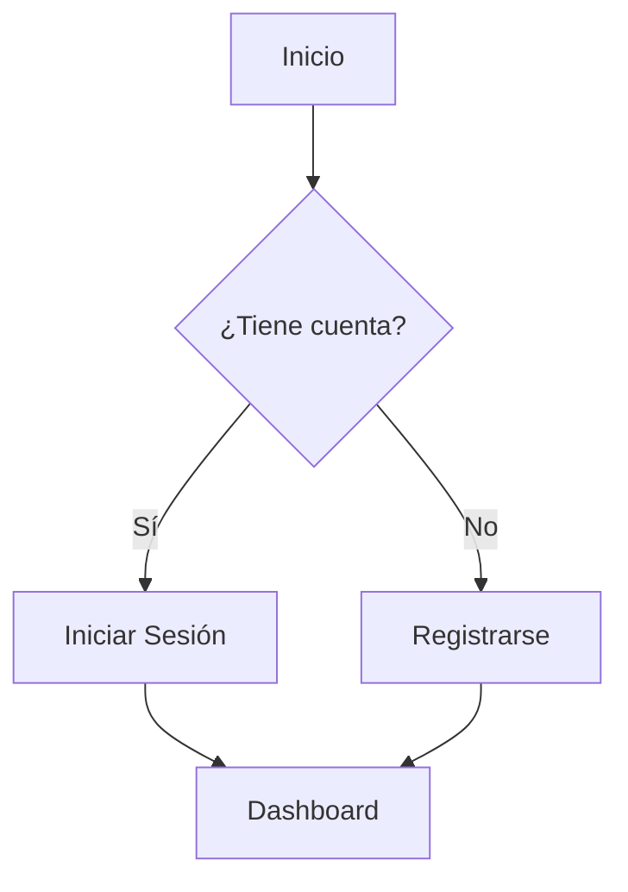

# Guía de Desarrollo Web

## Introducción
Bienvenido a la guía completa de desarrollo web. Este documento cubre varios temas esenciales.

### Contenido Destacado
!!! important
Este es un bloque de contenido importante que debería estilizarse de manera especial.
!!!

## Código de Ejemplo

### HTML Básico
```html
<!DOCTYPE html>
<html lang="es">
<head>
    <meta charset="UTF-8">
    <title>Mi Página Web</title>
</head>
<body>
    <h1>¡Hola Mundo!</h1>
</body>
</html>
```

### CSS Moderno
```css
.container {
    display: grid;
    grid-template-columns: repeat(auto-fit, minmax(200px, 1fr));
    gap: 1rem;
    padding: 2rem;
    background: linear-gradient(45deg, #ff6b6b, #4ecdc4);
}
```

### JavaScript Avanzado
```javascript
const fetchData = async () => {
    try {
        const response = await fetch('https://api.ejemplo.com/data');
        const data = await response.json();
        return data;
    } catch (error) {
        console.error('Error:', error);
    }
}
```

## Recursos Multimedia

### Video Tutorial
!!! video
https://www.youtube.com/watch?v=6wJ52H0aq9Q
!!!

### Mapa de Ejemplo
!!! image
https://upload.wikimedia.org/wikipedia/commons/7/76/Croatia_location_map.svg
!!!

## Ejemplos de Formato

### Tablas
| Característica | Básico | Pro | Enterprise |
|----------------|--------|-----|------------|
| Usuarios       | 10     | 100 | Ilimitado  |
| Almacenamiento | 5GB    | 50GB| 500GB      |
| Soporte        | Email  | 24/7 | Dedicado   |

### Listas
!!! info
Lista de verificación para el desarrollo:
- [x] Planificación del proyecto
- [x] Diseño de la interfaz
- [ ] Implementación del backend
- [ ] Pruebas de integración
!!!

### Citas y Referencias
> El buen código es su mejor documentación. Cuando estés a punto de añadir un comentario, pregúntate: "¿Cómo puedo mejorar el código para que este comentario no sea necesario?"
> -- *Steve McConnell*

## Notas Especiales

!!! warning
Asegúrate de hacer respaldo de tus archivos antes de realizar cambios importantes.
!!!

!!! tip
Utiliza herramientas de control de versiones como Git para mantener un historial de cambios.
!!!

### Ejemplo de Diagrama


## Recursos Adicionales

### Enlaces Útiles
- [Documentación Completa](#)
- [Foro de la Comunidad](#)
- [Centro de Ayuda](#)

!!! success
¡Has completado la revisión de este documento de ejemplo!
!!!
